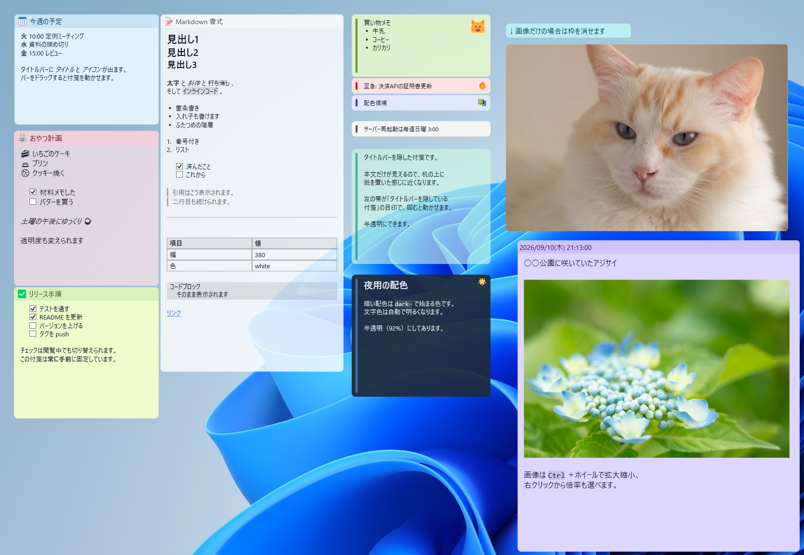
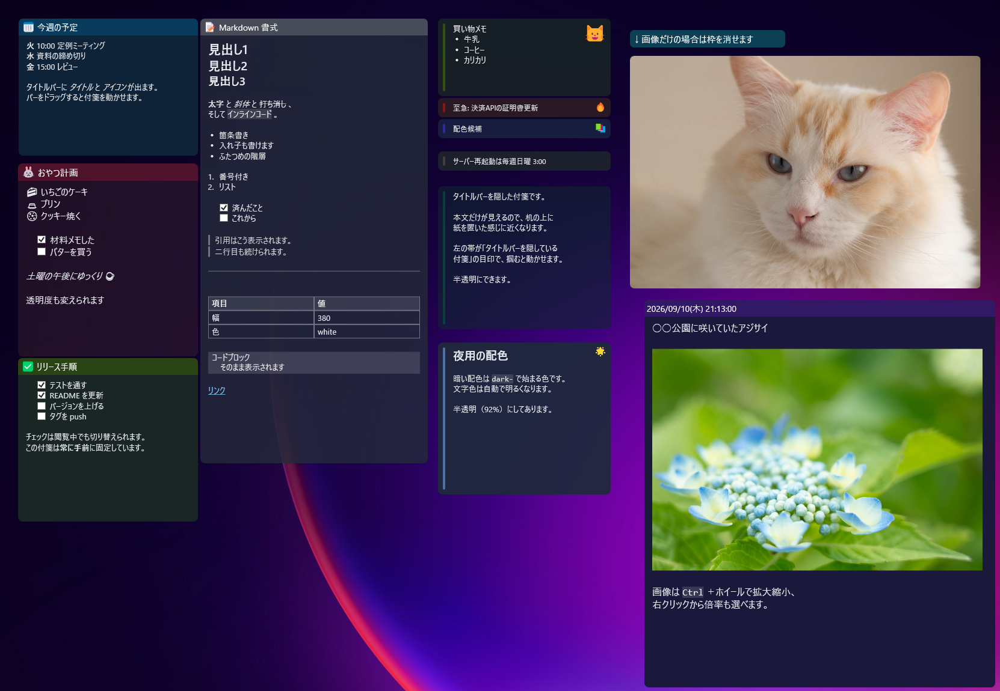

# ScreenPinNotes

[English](README.md) | 日本語

予定、チェックリスト、写真をデスクトップに。ScreenPinNotesは、Markdownと画像を使えるWindows用の付箋アプリです。付箋はローカルファイルに自動保存されます。

[ダウンロード](https://github.com/umineko73/ScreenPinNotes/releases) · [操作ガイド](docs/guide.ja.md)

## デスクトップに合わせた付箋

色やアイコンでメモを見分け、必要な付箋を手前に固定。タイトルバーを隠したり、1行に折りたたんだり、半透明にしたりして、作業スペースに合わせて置けます。

### ライトモード

予定や買い物リスト、Markdownの表、写真を並べた日本語の表示例。明るいテーマでも、付箋ごとに暗い配色を選べます。



### ダークモード

暗いデスクトップに合わせた配色。タイトルバーのないメモや、画像だけを表示する付箋も使えます。テーマと言語は設定から変更できます。



## 主な機能

| 機能 | できること |
| --- | --- |
| Markdown | 見出し、太字、斜体、取り消し線、リスト、引用、コード、表、リンクを表示 |
| チェックリスト | 閲覧中でもクリックで完了・未完了を切り替え |
| 画像 | 貼り付けた画像を保存・表示。拡大縮小や画像に合わせた付箋サイズの調整 |
| 表のやり取り | Excelから表を貼り付け、Markdownの表をExcel向けにコピー |
| 見た目の調整 | 色、フォント、アイコン、透明度、角丸、枠、タイトルバーの表示を変更 |
| 配置 | 最前面へのピン止め、折りたたみ、画面端や付箋へのスナップ、重なり順の保存 |
| リマインダー | 一度だけ・毎日・毎週・毎月の通知。枠の点滅やスヌーズにも対応 |
| 付箋一覧 | 検索、表示・非表示の切り替え、重なり順やリマインダーの管理 |
| 外部ファイル | `.md` / `.txt` を読み取り専用の付箋として開き、ファイルの変更を反映 |
| ローカル保存 | 本文はMarkdown、設定はJSON。zipバックアップの書き出し・取り込み |

## はじめに

Windows 10以降・x64対応。インストールは不要です。

1. [Releases](https://github.com/umineko73/ScreenPinNotes/releases)からzipをダウンロードし、展開します。
2. `ScreenPinNotes.exe` を起動します。
3. `Ctrl+Alt+N`、またはトレイアイコンの右クリックメニューから付箋を作成し、そのまま入力します。

| 配布ファイル | 実行環境 |
| --- | --- |
| `ScreenPinNotes-x.y.z-win-x64.zip` | ランタイム同梱。通常はこちら |
| `ScreenPinNotes-x.y.z-win-x64-runtime.zip` | .NET 8 Desktop Runtimeが必要 |

## 基本操作

| 操作 | 動作 |
| --- | --- |
| 本文をダブルクリック | Markdownソースを編集 |
| `Ctrl+Enter` / `Esc` / `✓` | 変更を保存して編集を終了 |
| タイトルバーや左の帯をドラッグ | 付箋を移動 |
| タイトルバーをダブルクリック、または `⮝` / `⮟` | 折りたたみ・展開 |
| `📌` | 最前面への固定を切り替え |
| タイトル・本文・画像を右クリック | 場所に応じたメニューを開く |
| `Ctrl` + ホイール | 本文・タイトルの文字サイズ、または画像サイズを変更 |
| チェックボックスをクリック | タスクの完了・未完了を切り替え |
| トレイから「付箋一覧」を開く | 付箋の検索や表示状態を管理 |

本文とタイトルは編集中も自動保存されます。`Esc` は編集の取り消しではありません。「非表示」は付箋を残し、「削除」は付箋を削除します。

詳しいショートカット、表示モード、リマインダー、設定は[操作ガイド](docs/guide.ja.md)をご覧ください。リマインダーを受け取るには、アプリを起動しておく必要があります。

## 保存とバックアップ

既定の保存先は `%AppData%\ScreenPinNotes` です。

```text
ScreenPinNotes/
├─ settings.json
└─ notes/<note-id>/
   ├─ meta.json     # 位置、配色、リマインダーなど
   ├─ content.md    # 本文
   └─ assets/       # 画像
```

設定から保存先を変更し、zip形式のバックアップを書き出し・取り込みできます。取り込みは既存の付箋を上書きせずに追加します。`SCREENPINNOTES_DATA` 環境変数で別のデータフォルダーを指定することもできます。

## 開発

Windowsと.NET 8 SDKを使用します。

```powershell
git clone https://github.com/umineko73/ScreenPinNotes.git
cd ScreenPinNotes
dotnet build
dotnet run --project src
dotnet test
```

配布用zipは `powershell -ExecutionPolicy Bypass -File scripts/publish.ps1` で作成できます（出力先: `artifacts/`）。翻訳の追加は[ローカライズ手順](docs/localization.md)をご覧ください。

## ライセンス

[GNU General Public License v3.0以降](LICENSE) · Copyright (C) 2026 umineko73
