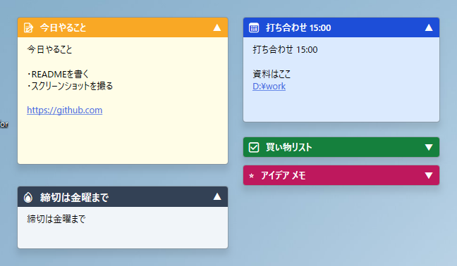

# ScreenPinNotes

[English](README.md) | 日本語

Windows 11 向けのデスクトップ付箋アプリです。



## 特徴

- 折りたたみ表示
- 折りたたみ表示/展開表示の位置・幅を個別保存
- 閲覧モード / 編集モード
- Markdown 表示
- 非表示付箋
- 付箋一覧と全付箋検索
- 単発リマインダーとスヌーズ
- 画面端・付箋間スナップ
- 付箋ごとの不透明度設定
- カラー、アイコン、本文フォント、タイトルフォントの設定
- 付箋ごとの常に最前面
- タスクトレイ常駐
- 日本語 / 英語
- ライトモード / ダークモード
- 画像貼り付け
- Excel表の貼り付け / コピー
- Excelからの画像貼り付け
- スタートアップ登録
- 自動保存
- ノート保存フォルダの変更
- 外部 `.md` / `.txt` ファイルの読み取り専用付箋表示

## Markdown 記法

編集モードでは Markdown ソース、閲覧モードでは整形結果を表示します。

| 記法 | 効果 |
|------|------|
| `# 見出し` 〜 `###### 見出し` | 見出し（6段階） |
| `**太字**` / `__太字__` | 太字 |
| `*斜体*` / `_斜体_` | 斜体 |
| `~~取り消し~~` | 取り消し線 |
| `` `コード` `` / ` ```ブロック``` ` | インラインコード / コードブロック |
| `- 項目` / `1. 項目` / `- [ ]` | リスト（チェックリストはクリックで切替可） |
| `> 引用` / `---` | 引用 / 水平線 |
| `\| a \| b \|` | 表 |
| `[表示名](url)` / `<https://example.com>` | リンク（URL/パス内の `(` に対応。リンクタイトルは無視） |
| `` | 画像（`{width=240}` でサイズ指定） |

テーブル区切り行の `:---`、`:---:`、`---:` は列揃えに反映されます。`\*`、`\[` などの基本エスケープに対応しています。

貼り付けた画像は付箋フォルダの `assets` にPNGとして保存されます。画像サイズは右クリックまたは画像上のマウスホイールで20〜200%に変更できます。サイズ指定のない画像が付箋からはみ出る場合は、付箋の幅に収まるように表示されます。

画像を拡大してスクロールバーが出た場合は、本文ペイン内のどこでも右ボタンドラッグでスクロールできます。右クリックだけなら従来どおりコンテキストメニューを開きます。画像右クリックの **画像に合わせて付箋のサイズを調整** は対象画像に合わせます。本文右クリックの同名メニューは複数画像を含む全体に合わせます。

インライン表示されるのはローカルファイルの画像のみで、`http(s)://` の画像URLは `` の形には変換されますがプレビューはされません。

## ダウンロード

[Releases](https://github.com/umineko73/ScreenPinNotes/releases) からzipを取得して展開します。インストールは不要です。

| ファイル | 必要なもの |
|----------|-----------|
| `ScreenPinNotes-x.y.z-win-x64.zip`（約68MB） | なし |
| `ScreenPinNotes-x.y.z-win-x64-runtime.zip`（約11MB） | [.NET 8 Desktop Runtime](https://dotnet.microsoft.com/download/dotnet/8.0) |

## 動作環境

Windows 10 以降（角丸表示は Windows 11 のみ）、x64。ビルドには .NET 8 SDK が必要です。

## ビルドと実行

```bash
git clone https://github.com/umineko73/ScreenPinNotes.git
cd ScreenPinNotes
dotnet build
dotnet run --project src
```

配布用zip: `powershell -ExecutionPolicy Bypass -File scripts/publish.ps1`（`artifacts/` に生成）。

## 使い方

| 操作 | 動作 |
|------|------|
| 本文をダブルクリック | 編集モードに入る |
| Escape / Ctrl+Enter / 編集ツールバーの ✓ | 編集を終えて閲覧モードに戻る |
| タイトルバーをドラッグ / ダブルクリック | 移動 / 折りたたみ表示・展開表示の切り替え |
| タイトル上で右クリック | タイトル編集・重なり順・不透明度・展開表示の位置・リマインダー・外部ファイル操作・非表示・削除（外部ファイルの原本は保持） |
| 本文上で右クリック | 編集操作・Markdown書式（編集中）・リンク/表操作・画像に合わせたサイズ調整・リマインダー・外部ファイル操作・非表示・削除 |
| 本文/画像上で Ctrl+ホイール | フォント/画像サイズ変更 |
| スクロール可能な本文ペインで右ボタンドラッグ | ペインをスクロール |
| タスクトレイアイコン 左/右クリック | 全表示切替 / メニュー |

右クリックメニューの上にはミニツールバーを表示します。`A-` / `A+` は本文サイズ、`T-` / `T+` はタイトルサイズ、`Aa` はフォント、🦊 はアイコン、🎨 は色の変更です。色・アイコン変更の独立したメニュー項目はありません。

編集時は付箋の下に同じツールバーと緑色の `✓`（編集完了）を表示します。`Ctrl+Enter` または `Esc` でも編集を終了できます（変更を取り消す操作ではありません）。ツールバーは移動・リサイズに追従し、リンク編集ダイアログの表示中は隠れます。

### 編集用サイズ

初回の編集は通常表示と同じサイズです。編集中にリサイズすると、その幅・高さを付箋ごとに記憶します。編集終了時は通常サイズに戻り、次回編集時に編集用サイズを再適用します。位置は通常表示と共通で、画面外にはみ出す場合は補正します。折りたたみ時の幅は別に保存します。

### 色・アイコン・フォント

- ダーク系6色を含む配色を選べます。ダーク系はライトモードでも暗い背景を保ちます。アプリのダークモードでは既存の淡色も暗色化し、文字・リンク・色見本を配色に合わせます。
- アイコンは色・記号、緊急・優先度、状態・進捗、メモ・資料、発想・調査、予定・連絡、仕事・開発、日常、動物の分類から選べます。🔥、色付きの丸・四角、動物15種類も利用できます。🔗は外部ファイル状態専用、Webの目印には🌐を使います。
- インストール済みフォントを日本語名優先で表示します。記号専用と判定できたフォントを除外し、判定できないものは残します。一覧は初回に読み込み、失敗時は再試行できます。
- よく使うフォントは最大5件を `★` 付きで上部に表示します。選択回数は全付箋で共有し、再起動後も保持します。

### Markdown入力補助

編集中に文字列を選択して右クリックし、**Markdown書式** から太字、取り消し線、インラインコード、見出し1〜3、箇条書き、チェックリスト、リンクを選べます。行の書式は選択がかかる行全体に適用します。太字などは選択がないと記号の間にカーソルを置き、対応する同じ書式の再選択で解除できます。`Ctrl+Z` で元に戻せます。

既存リンク内にカーソルを置いて **リンクを編集...** を選ぶと、表示テキストとURLを別々に編集できます。URLは折り返し表示され、ダイアログは拡大できます。**Markdown書式 > リンクを挿入・編集...** から新規リンクも作成できます。

任意の書式の組み合わせを検証・修正する機能ではありません。描画失敗時は原文表示へ切り替えます。深い入れ子（16段）、長いインライン文字列（8,192文字超）、大きい文書（131,072文字超または改行2,000個超）は解析を制限して原文を表示します。本文自体は削除しません。

折りたたみ表示と展開表示の位置・幅は別々に保存されます。画面下に置いた折りたたみ表示の付箋を展開表示にする場合は、画面内に収まる位置へ調整します。位置が分離中の付箋はタイトルバーに `⛓️‍💥` を表示し、タイトル右クリックの **折りたたみ時の位置にそろえる** で折りたたみ表示の位置へ揃えます。

タイトルバーの `Ctrl + ドラッグ` は現在の状態だけ位置を調整します。`Alt + ドラッグ` はスナップを無効化します。`Ctrl + Alt + ドラッグ` では、現在の状態だけをスナップなしで移動できます。設定でシングルクリック切り替えに戻せます。

タスクトレイの **付箋一覧...** から、全付箋の検索、表示/非表示、リマインダー、削除、外部ファイル操作をまとめて行えます。外部ファイル付箋の「付箋を削除（元のファイルは残す）」は、付箋だけを削除します。検索対象はタイトル、本文、リマインダー、外部ファイルのパスです。

付箋の右クリックメニューまたは **付箋一覧...** の **リマインダー...** から、単発リマインダーを設定できます。リマインダー付きの付箋はタイトルバーに `⏰` を表示し、マウスを乗せると予定時刻を確認できます。時刻になると付箋を表示し、完了、5分、15分、1時間のスヌーズを選べる通知を出します。

タスクトレイの **外部ファイルを付箋として開く...** から `.md` / `.txt` を選ぶと、そのファイルを読み取り専用の付箋として表示します。外部ファイル付箋はタイトルバー左に `🔗` を表示し、タイトルまたは `🔗` にマウスを乗せるとファイルパスを確認できます。ファイルが他のアプリで変更されると付箋も再読み込みします。外部Markdown内の相対画像パスは、外部ファイルのあるフォルダを基準に解決します。外部ファイル付箋での画像サイズ変更は付箋側の表示設定として保存し、元ファイルは変更しません。

タスクトレイの **非表示の付箋** から、非表示にした付箋を個別または **非表示の付箋をすべて表示** で再表示できます。**付箋をすべて表示** は `IsHidden=false` の付箋のみ表示します。

タスクトレイの設定サブメニューには、スタートアップ登録、保存フォルダ、ダークモード、言語、折りたたみ中の本文プレビュー、折りたたみ・展開のアニメーション、折りたたみ・展開ボタンがあります。

## settings.json

`%APPDATA%\ScreenPinNotes\settings.json` に保存されます。`Language`、`Theme`、`StorageRoot`、`MaxNoteContentBytes`、UIトグル、タイミング設定を含みます。`MaxNoteContentBytes` は付箋本文 `content.md` の上限で、既定値は 1048576 バイト（1MB）です。設定ファイルが無い場合は、OSのUIロケールから `Language` の初期値を決めます。直接編集した場合はアプリの再起動が必要です。

## データの保存場所

`settings.json` の `FontUsage` にフォントの選択回数、`IconPalette` / `IconPaletteVersion` にアイコンパレットの設定を保存します。付箋の `meta.json` の `EditWidth` / `EditHeight` は編集用サイズです（未設定の場合は通常サイズを使用）。

```
%AppData%\ScreenPinNotes\
  settings.json
  logs\app.log
  notes\{付箋ID}\meta.json, content.md, assets\
```

ノート本体は `StorageRoot` 配下に保存されます。各付箋の `meta.json` には位置、サイズ、折りたたみ表示の位置/幅、非表示状態、リマインダー設定、外部ファイル付箋のリンク先などが保存されます。本文は `content.md`、画像は `assets` に保存されます。保存フォルダはタスクトレイの **設定 > 保存フォルダを選択...** または初回起動前の環境変数 `SCREENPINNOTES_DATA` で指定できます。

保存先に付箋が無い場合は `SampleNotes` からサンプル付箋をコピーします。日本語OSでは日本語サンプル、日本語以外のOSでは英語サンプルを使います。

## 開発

```
src/
  App.xaml(.cs)      エントリポイント・タスクトレイ常駐
  Models/            データモデル
  ViewModels/        ビューモデル
  Views/             付箋ウィンドウ（XAML + コードビハインド）
  Services/          永続化・Markdown・リンク検出など
  SampleNotes/       初回起動時にコピーされるサンプル付箋
```

付箋1枚は1つの `Window` です。`WindowStyle="None"` と `WindowChrome` で独自タイトルバーを描画します。

## ライセンス

ライセンス: [GNU General Public License v3.0 or later](LICENSE)

Copyright (C) 2026 umineko73
