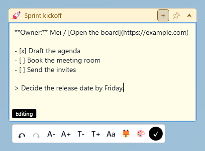
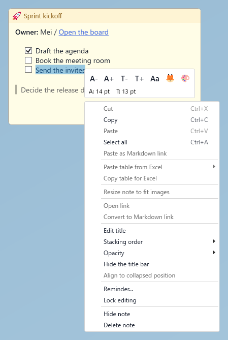
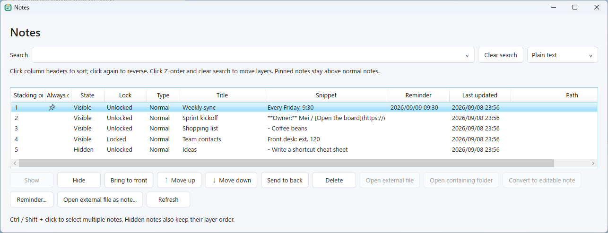
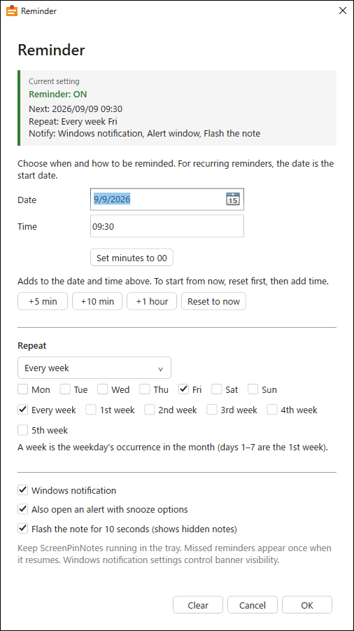
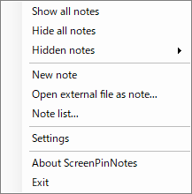
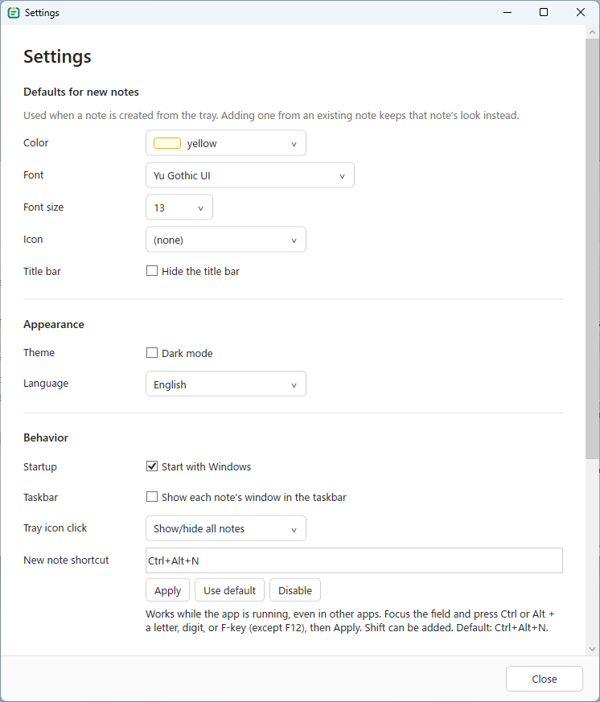

# ScreenPinNotes

English | [日本語](README.ja.md)

A Windows desktop sticky notes app with Markdown, images, and recurring reminders. Notes autosave as local files.


## Get started

1. Download and extract a zip from [Releases](https://github.com/umineko73/ScreenPinNotes/releases).
2. Launch `ScreenPinNotes.exe`.
3. Right-click the tray icon or press `Ctrl+Alt+N` to create a note. It opens in edit mode with the body ready for typing. Double-click an existing note's body to edit it.

| Package | Requirements |
| --- | --- |
| `ScreenPinNotes-x.y.z-win-x64.zip` | Runtime included |
| `ScreenPinNotes-x.y.z-win-x64-runtime.zip` | .NET 8 Desktop Runtime |

Windows 10 or later, x64. No installation needed. Corners are drawn inside each note, without a window shadow.

## Display modes

Title bar visibility and collapse/expand are independent settings.

| Title bar | Expanded | Collapsed |
| --- | --- | --- |
| Visible | Title and body | Title only |
| Hidden | Body with controls at the top right | First body line without Markdown formatting |

- Toggle the title bar with **Hide title bar** in the context menu.
- A note with a hidden title bar carries a spine down its left edge. Collapsed, it looks like any note showing only its title bar, so the spine tells them apart. **Hidden title bar marker** in settings turns it off or changes its width (1-12px).
- Use `⮝` / `⮟` or double-click the title bar to collapse or expand.
- Image-only notes show their image path in single-line mode. Narrow notes retain the end, such as `…/photos/image.png`.
- An empty title falls back to the body. A title you enter takes priority.
- Editing shows Markdown source and an *Editing* label. The label moves above the horizontal scrollbar when it appears. Edit width and height are remembered separately from view mode.
- Expanding a note temporarily brings it above pinned notes while you work with it. Switching to another window or collapsing the note ends this temporary raise without changing its pin setting.

## Mouse actions

| Action | Result |
| --- | --- |
| Double-click the body | Start editing |
| Drag the title bar | Move; snap to screen edges and other notes |
| Drag the top-right control area with the title bar hidden | Move the note |
| Double-click the title bar | Collapse/expand; configurable as a single click |
| Drag an edge | Resize; collapsed notes resize horizontally only |
| Right-click the title or body | Open the menu for that area |
| Click a link | Open it |
| Click a checklist checkbox | Toggle completion |
| Right-drag a scrollable body | Scroll the body |

## Modifier keys and shortcuts

While the app is running, **Ctrl+Alt+N** creates a new note from other apps. In Settings, focus the New note shortcut field, press a key combination, and click Apply. You can also restore the default or disable the shortcut. If another app has registered the combination, the previous shortcut remains active.

| Action | Result |
| --- | --- |
| `Ctrl` + drag | Move only the current display mode's position |
| `Alt` + drag | Move without snapping |
| `Ctrl+Alt` + drag | Move only the current mode, without snapping |
| `Ctrl` + wheel over the body | Change body font size |
| `Ctrl` + wheel over the title bar | Change title font size |
| `Ctrl` + wheel over an image | Resize the image |
| `Ctrl+Enter` / `Esc` / `✓` | Finish editing and keep changes |
| `Enter` while editing the title | Confirm the title |
| `Ctrl+Z` | Undo an edit |
| `Ctrl+Y` | Redo an undone edit |
| `Ctrl+C` / `Ctrl+X` / `Ctrl+V` | Copy/cut/paste |
| `Alt+F4` / taskbar close | Hide the note |

Normal dragging links expanded and collapsed positions. Use **Align to collapsed position** to reconnect separated positions. Each mode remembers its own width. Snapping adjacent notes leaves a one-physical-pixel gap.

## Icons and toolbars



| Symbol | Meaning or action |
| --- | --- |
| `＋` | Create a note using this note's appearance |
| `📌` | Toggle always-on-top |
| `⮝` / `⮟` | Collapse / expand |
| `🦊` and other icons | Identify a note |
| `🔗` | Linked to an external file |
| `🔒` | Editing is locked |
| `⛓️‍💥` | Expanded and collapsed positions are separate |
| `⏰` | Reminder set; hover for its next time |
| `A−` / `A＋` | Body font size |
| `T−` / `T＋` | Title and single-line font size |
| `Aa` / `🦊` / `🎨` (mini toolbar) | Font / icon / color picker |
| `↶` / `↷` (editing toolbar) | Undo / redo |
| Round `✓` | Finish editing; black in light mode, white in dark mode |

The mini toolbar appears above context menus and below the note while editing. When there is no room below, such as near the taskbar, the editing toolbar appears above the note and stays within the screen's working area. `🔒`, `⛓️‍💥`, and `⏰` are status indicators.

The editing toolbar's `↶` / `↷` buttons act on the body or title field you are editing. Autosaving preserves undo and redo history. Buttons are disabled when no corresponding history is available.

Icon and color palettes appear in front of notes. Click the same editing toolbar button again to close its palette. Clicking outside the palette or switching to another window also closes it.

## Context menus



| Location | Main actions |
| --- | --- |
| Title | Edit/copy title, stacking order, opacity, reconnect positions |
| Body in view mode | Copy, open links, copy Excel tables, fit the window to images |
| Body in edit mode | Cut/paste/select all, Markdown formatting, edit links, paste Excel tables |
| Image | Image sizing and other image actions |
| Shared by title and body | Hide title bar, opacity, reminders, edit lock, hide, delete |

Use the mini toolbar for colors, fonts, and icons. Unavailable actions are disabled or hidden.

**Hide** keeps the note; **Delete** removes it. Edit lock restricts body/title editing and deletion, while appearance, position, and checklist completion remain adjustable.

## Markdown, images, and Excel

| Type | Syntax or action |
| --- | --- |
| Headings | `# Heading` through `###### Heading` |
| Formatting | `**bold**`, `*italic*`, `~~strike~~` |
| Code | Enclose inline code with one backtick; blocks with three |
| Lists | `- item`, `1. item`, `- [ ] task` |
| Quotes and rules | `> quote`, `---` |
| Tables | Pipe-separated Markdown tables, with column alignment |
| Links | `[label](URL)` or a plain URL |
| Images | ``; append `{width=240}` to set width |

- Use **Markdown formatting** while editing to insert syntax. **Edit link** changes a link's label and URL.
- Pasted images are saved as PNGs in the note's `assets` folder. Local images render inline; web image URLs do not.
- Resize images between 20% and 200% using their context menu or `Ctrl` + wheel.
- Use the context menu to paste/copy Excel tables. Pasting images is also supported.
- Very large documents or deeply nested formatting fall back to source text without discarding content.

## Note list



Open **Note list** from the tray. Columns show layer order, pin status, visibility, edit lock, title, body excerpt, reminder, update time, and external path.

- **Search**: choose plain text, wildcard (`*` for any sequence, `?` for one character), or regular expression. Searches ignore case. Invalid or excessively slow patterns show an error.
- **History**: Enter or leaving the search field saves the query. The latest 30 entries persist across restarts and can be selected from the field's dropdown. **Clear search** clears the query while keeping history.
- **Multiple selection**: Ctrl/Shift-click notes, then use **Show / Hide** for the entire selection. Deletion, reminders, and other individual actions operate on one note at a time.
- **Layers**: higher rows appear in front. Use **Bring to front, Move up, Move down, Send to back**. The order persists across restarts and includes hidden notes. Always-on-top notes form a separate group above normal notes.
- **Sorting**: click a column header, then click again to reverse direction (▲/▼). This sorts only the list, leaving the actual stacking order intact. Click **Z-order** to return to layer order. Layer movement is available in layer order with search cleared.

## Reminders



Configure a reminder from a note's context menu or the **Note list**. Choose a date from the calendar. The editor appears above pinned notes.

**+5 min, +10 min, +1 hour** add to the date and time currently entered, including repeated clicks and crossing midnight. Use **Reset to now** then **+10 min** for ten minutes from now. **Set minutes to 00** keeps the date and hour. Choose a future time before saving.

| Repeat | Schedule |
| --- | --- |
| Once | Date and time |
| Daily | Start date and daily time |
| Weekly | Start date, time, and one or more weekdays |
| Monthly | Start date, time, and day 1–31; shorter months use their last day |

Click a Windows notification to open the note list. Simultaneous reminders share a notification. Optionally enable the alert window for 5-, 15-, or 60-minute snooze. Snoozing preserves the recurring time.

**Flash note border for 10 seconds** is enabled by default. It shows hidden notes and slowly pulses the border. Clicking, typing, or hiding the note stops the effect. Windows notifications, snooze alerts, and flashing can be combined; flashing alone is also supported.

The app must be running in the tray. Missed reminders are delivered once on restart or resume. Windows notification settings control banners and sound.

## Tray, settings, and external files



| Feature | Purpose |
| --- | --- |
| Tray left-click | Toggle all notes or create a new note, as selected in settings |
| Tray right-click | Create notes, note list, hidden notes, settings, exit |
| Note list | Search titles, bodies, external paths, and more; manage visibility, reminders, and deletion |
| Hidden notes | Restore individually hidden notes; Show all does not restore them |
| Settings | New-note defaults, theme, language, note appearance, startup, taskbar/tray behavior, and storage |
| Open external file as note | Display `.md` / `.txt` read-only and follow file changes |



**Settings > Appearance** collects how notes look: corner radius (0-16px, *Square* by default), border color (none by default; gray or the note's own color are also available), icon color (color or monochrome), and the hidden title bar marker. Changes reach open notes right away.

Over a white background a borderless pale note has almost no visible edge. Set the border color to gray or the note's own color to keep one.

Settings save immediately (shortcut changes require Apply). New-note defaults apply to tray- and shortcut-created notes; `＋` on a note copies its appearance.

External notes show `🔗`. Their menu can open the file or folder, or convert the content into an editable note. Deleting the note or changing image display sizes does not modify the original file.

## Storage and backups

The body and title autosave during editing. By default, changes save about 0.8 seconds after typing pauses, or about every 5 seconds while typing continuously. Finishing editing also saves pending changes; `Esc` does not discard edits.

Default location: `%AppData%\ScreenPinNotes`.

```text
ScreenPinNotes/
├─ settings.json
├─ logs/app.log
└─ notes/<note-id>/
   ├─ meta.json     # Position, color, reminders, etc.
   ├─ content.md    # Body
   └─ assets/       # Images
```

Use **Settings** to change storage or export/import zip backups. Imports add notes without overwriting existing ones. The default body limit is 1 MB.

Set `SCREENPINNOTES_DATA` to run with a separate data directory. Close the app before manually editing `settings.json`.

## Development and license

Use Windows and the .NET 8 SDK.

```powershell
git clone https://github.com/umineko73/ScreenPinNotes.git
cd ScreenPinNotes
dotnet build
dotnet run --project src
dotnet test
```

Build release zips with `powershell -ExecutionPolicy Bypass -File scripts/publish.ps1` (output: `artifacts/`). See [localization instructions](docs/localization.md) for translations.

[GNU General Public License v3.0 or later](LICENSE) · Copyright (C) 2026 umineko73
