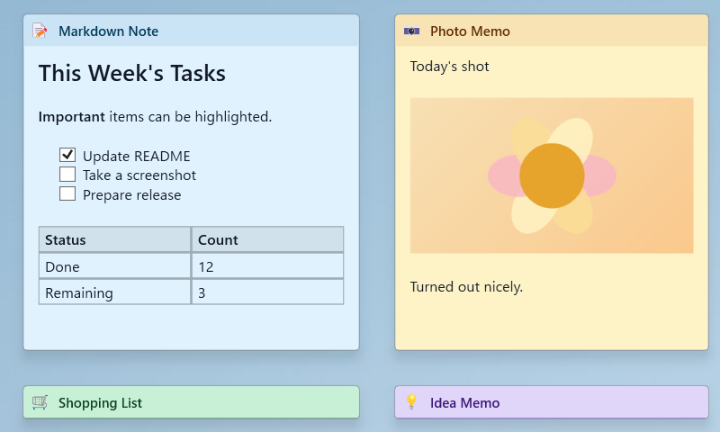

# ScreenPinNotes

English | [日本語](README.ja.md)

A desktop sticky notes app for Windows 11.



## Features

- Collapsed view
- Separate collapsed view/expanded view positions and widths
- View mode / edit mode
- Markdown rendering
- Hidden notes
- Note list and full-note search
- One-time reminders with snooze
- Snapping to screen edges and other notes
- Per-note opacity
- Color, icon, body font, and title font settings
- Per-note always-on-top
- System tray
- Japanese / English
- Light mode / dark mode
- Image paste
- Paste/copy Excel tables
- Paste images from Excel
- Startup registration
- Autosave
- Configurable note storage folder
- Read-only sticky display for external `.md` / `.txt` files

## Markdown syntax

Edit mode shows Markdown source. View mode shows rendered content.

| Syntax | Effect |
|------|------|
| `# Heading` – `###### Heading` | Headings (6 levels) |
| `**bold**` / `__bold__` | Bold |
| `*italic*` / `_italic_` | Italic |
| `~~strike~~` | Strikethrough |
| `` `code` `` / ` ```block``` ` | Inline code / code block |
| `- item` / `1. item` / `- [ ]` | Lists, incl. clickable checklists |
| `> quote` / `---` | Blockquote / horizontal rule |
| `\| a \| b \|` | Table |
| `[label](url)` / `<https://example.com>` | Link, including URLs/paths containing `(`. Link titles are ignored |
| `` | Image (`{width=240}` to size it) |

Table separators `:---`, `:---:`, and `---:` set column alignment. Basic escapes such as `\*` and `\[` are supported.

Pasted images are saved as PNGs under the note's `assets` folder. Image size can be changed from 20% to 200% from the context menu or with the mouse wheel over the image. Images without an explicit width are fitted to the note width when they would overflow.

When a zoomed image has scrollbars, right-drag anywhere in the body pane to scroll it. A simple right-click still opens the context menu. **Fit window to image** from an image context menu fits the note to that image. **Resize note to fit images** from the body context menu fits the note to all images in the note.

Only local file images render inline — an `http(s)://` image URL converts to `` syntax but won't preview.

## Download

Download a zip from [Releases](https://github.com/umineko73/ScreenPinNotes/releases) and extract it. Installation is not required.

| File | Requires |
|----------|-----------|
| `ScreenPinNotes-x.y.z-win-x64.zip` (~68MB) | Nothing |
| `ScreenPinNotes-x.y.z-win-x64-runtime.zip` (~11MB) | [.NET 8 Desktop Runtime](https://dotnet.microsoft.com/download/dotnet/8.0) |

## Requirements

Windows 10 or later (rounded corners require Windows 11), x64. Building requires the .NET 8 SDK.

## Build and run

```bash
git clone https://github.com/umineko73/ScreenPinNotes.git
cd ScreenPinNotes
dotnet build
dotnet run --project src
```

Distributable zips: `powershell -ExecutionPolicy Bypass -File scripts/publish.ps1` (into `artifacts/`).

## Usage

| Action | Effect |
|------|------|
| Double-click the body | Enter edit mode |
| Escape | Return to view mode |
| Drag / double-click the title bar | Move / switch collapsed view/expanded view |
| Right-click the title | Edit title, icon/color, stacking order, opacity, expanded-view position, reminder, external-file actions, hide, delete note |
| Right-click the body | Change icon/color, edit text, work with links/tables, resize to images, set reminders, manage external files, hide, or delete the note |
| Ctrl+wheel over body/image | Resize font / image |
| Right-drag in a scrollable body pane | Scroll the pane |
| Tray icon left/right-click | Show all / open menu |

Every right-click menu starts with a 🎨 (color) and 😀 (icon) button row, so the palettes open without walking the menu. The same actions remain available as the **Change color** / **Change icon** items, which is what keyboard navigation uses.

Collapsed view and expanded view positions/widths are saved separately. When a note in collapsed view near the bottom of the screen switches to expanded view, the app moves the window inside the screen. Notes with separated positions show `⛓️‍💥` in the title bar; **Align to collapsed position** aligns both positions to the collapsed view position.

Use `Ctrl + drag` on the title bar to adjust only the current collapsed/expanded view. Use `Alt + drag` to disable snapping. Use `Ctrl + Alt + drag` to move only the current view without snapping. A setting can restore single-click switching.

Use **Note list...** from the tray menu to search all notes and manage visibility, reminders, deletion, and external-file actions. For external-file notes, "Delete note (keep original file)" deletes only the note. Search covers titles, body text, reminders, and external file paths.

Use **Reminder...** from a note's context menu or from **Note list...** to set a one-time reminder. Notes with reminders show `⏰` in the title bar; hovering it shows the scheduled time. When due, the note is shown and a reminder window offers Done, 5-minute, 15-minute, and 1-hour snooze actions.

Use **Open external file as note...** from the tray menu to display a `.md` or `.txt` file as a read-only sticky note. External-file notes show `🔗` at the left of the title bar, and hovering the title or `🔗` shows the file path. The note reloads when the external file changes. Relative image paths in external Markdown resolve from the external file's folder. Image size changes in external-file notes are saved as note-local display settings; the external file is not modified.

Use **Hidden notes** in the tray menu to restore hidden notes individually or with **Show all hidden notes**. **Show all notes** only shows notes with `IsHidden=false`.

The tray menu's Settings submenu contains startup, storage folder, dark mode, language, body preview while collapsed, collapse/expand animation, and collapse/expand button settings.

## settings.json

Saved at `%APPDATA%\ScreenPinNotes\settings.json`. It contains `Language`, `Theme`, `StorageRoot`, `MaxNoteContentBytes`, UI toggles, and timing settings. `MaxNoteContentBytes` limits the note body `content.md`; the default is 1048576 bytes (1 MB). When no settings file exists, the initial `Language` is chosen from the OS UI locale. Restart the app after editing the file directly.

## Data location

```
%AppData%\ScreenPinNotes\
  settings.json
  logs\app.log
  notes\{note id}\meta.json, content.md, assets\
```

Notes are stored under `StorageRoot`. The storage folder can be changed from **Settings > Select note folder...** in the tray menu or set with the `SCREENPINNOTES_DATA` environment variable before first run.

Each note's `meta.json` stores position, size, collapsed view position/width, hidden state, reminder settings, external-file links, and other metadata. The body is stored in `content.md`. Images are stored under `assets`.

If the storage folder contains no notes, the app copies sample notes from `SampleNotes`. Japanese OS locales use Japanese samples. Other OS locales use English samples.

## Development

```
src/
  App.xaml(.cs)      Entry point, system tray hosting
  Models/            Data models
  ViewModels/        View models
  Views/             Note windows (XAML + code-behind)
  Services/          Persistence, Markdown, link detection, etc.
  SampleNotes/       Sample notes copied on first launch
```

Each note is a single `Window`. `WindowStyle="None"` and `WindowChrome` draw the custom title bar.

## License

License: [GNU General Public License v3.0 or later](LICENSE)

Copyright (C) 2026 umineko73
