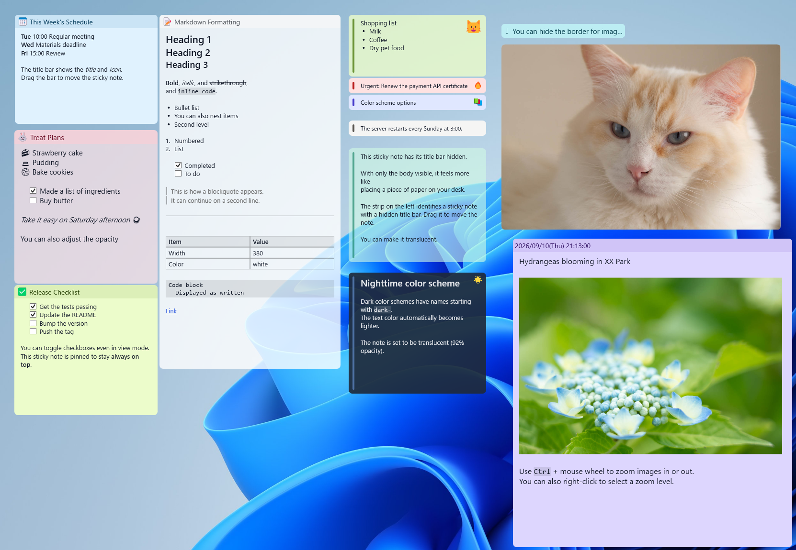
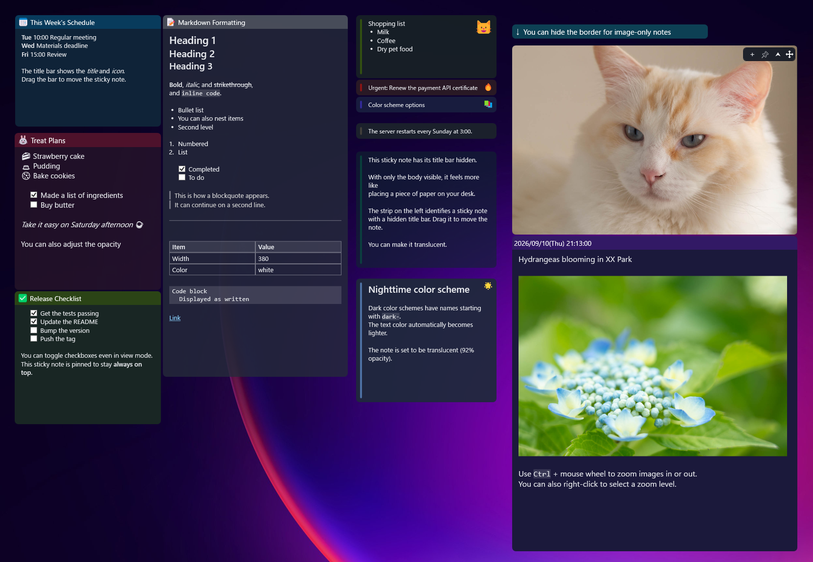

# ScreenPinNotes

English | [日本語](README.ja.md)

Keep schedules, checklists, and photos on your desktop. ScreenPinNotes is a Windows sticky notes app with Markdown and image support. Notes autosave as local files.

[Download](https://github.com/umineko73/ScreenPinNotes/releases) · [User guide](docs/guide.md)

## Notes that fit your desktop

Use colors and icons to tell notes apart, and pin the ones you need on top. Hide title bars, collapse notes to a single line, or adjust their opacity to fit your workspace.

### Light mode

Schedules, checklists, Markdown tables, and photos in the English interface. Individual notes can use dark colors even with the light theme selected.



### Dark mode

A darker palette for your desktop, including notes without title bars and notes that display only an image. Change the theme and interface language in Settings.



## Features

| Feature | What you can do |
| --- | --- |
| Markdown | Display headings, bold, italic, strikethrough, lists, quotes, code, tables, and links |
| Checklists | Toggle completion with a click, even in view mode |
| Images | Paste and save images, resize them, and fit a note to its images |
| Excel tables | Paste tables from Excel and copy Markdown tables back to Excel |
| Appearance | Choose colors, fonts, icons, opacity, corners, borders, and title bar visibility |
| Placement | Pin notes on top, collapse them, snap to screen edges or other notes, and save stacking order |
| Reminders | Schedule once, daily, weekly, or monthly; use flashing borders and snooze alerts |
| Note list | Search notes, show or hide them, and manage stacking order and reminders |
| External files | Open `.md` / `.txt` files as read-only notes that follow file changes |
| Local storage | Markdown bodies and JSON settings, with zip backup export and import |

## Get started

Windows 10 or later, x64. No installation needed.

1. Download a zip from [Releases](https://github.com/umineko73/ScreenPinNotes/releases) and extract it.
2. Launch `ScreenPinNotes.exe`.
3. Press `Ctrl+Alt+N` or right-click the tray icon to create a note and start typing.

| Package | Requirements |
| --- | --- |
| `ScreenPinNotes-x.y.z-win-x64.zip` | Runtime included; the usual choice |
| `ScreenPinNotes-x.y.z-win-x64-runtime.zip` | Requires .NET 8 Desktop Runtime |

## Everyday controls

| Action | Result |
| --- | --- |
| Double-click the body | Edit the Markdown source |
| `Ctrl+Enter` / `Esc` / `✓` | Save changes and finish editing |
| Drag the title bar or left-hand strip | Move the note |
| Double-click the title bar, or use `⮝` / `⮟` | Collapse or expand |
| `📌` | Toggle always-on-top |
| Right-click the title, body, or image | Open actions for that area |
| `Ctrl` + mouse wheel | Resize body text, title text, or the image under the pointer |
| Click a checkbox | Toggle task completion |
| Open **Note list** from the tray | Search notes and manage their visibility |

The body and title autosave while editing. `Esc` keeps your changes. **Hide** keeps a note; **Delete** removes it.

See the [user guide](docs/guide.md) for all shortcuts, display modes, reminders, and settings. The app must be running to deliver reminders.

## Storage and backups

The default data folder is `%AppData%\ScreenPinNotes`.

```text
ScreenPinNotes/
├─ settings.json
└─ notes/<note-id>/
   ├─ meta.json     # Position, colors, reminders, etc.
   ├─ content.md    # Body
   └─ assets/       # Images
```

Use Settings to change the storage location or export and import zip backups. Imports add notes without overwriting existing ones. You can also set the `SCREENPINNOTES_DATA` environment variable to use a separate data folder.

## Development

Use Windows and the .NET 8 SDK.

```powershell
git clone https://github.com/umineko73/ScreenPinNotes.git
cd ScreenPinNotes
dotnet build
dotnet run --project src
dotnet test
```

Build release zips with `powershell -ExecutionPolicy Bypass -File scripts/publish.ps1` (output: `artifacts/`). See the [localization instructions](docs/localization.md) to add translations.

## License

[GNU General Public License v3.0 or later](LICENSE) · Copyright (C) 2026 umineko73
