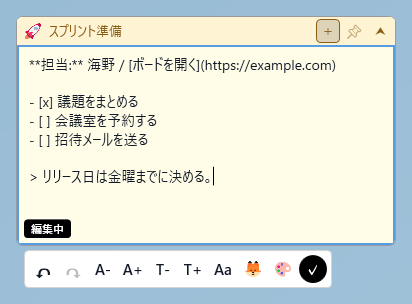
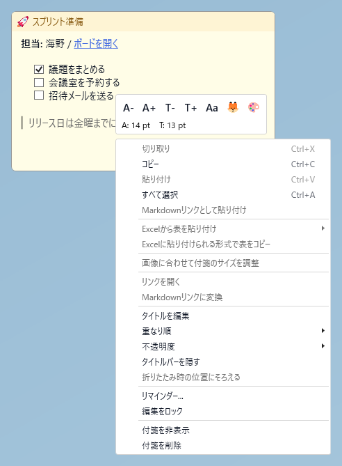
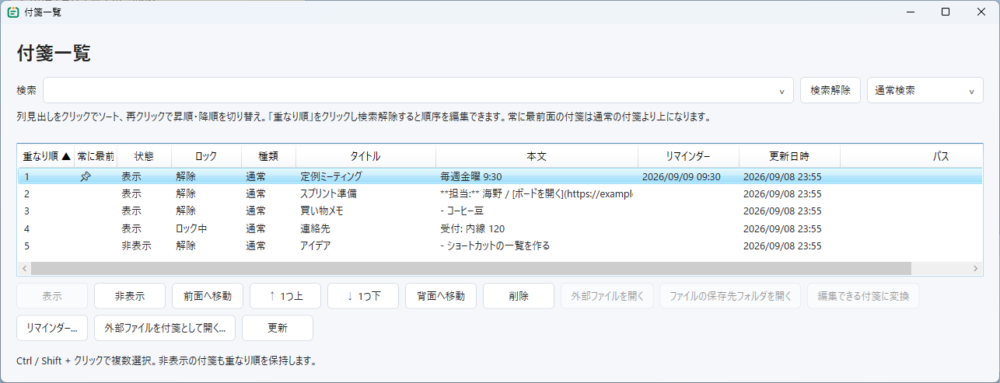
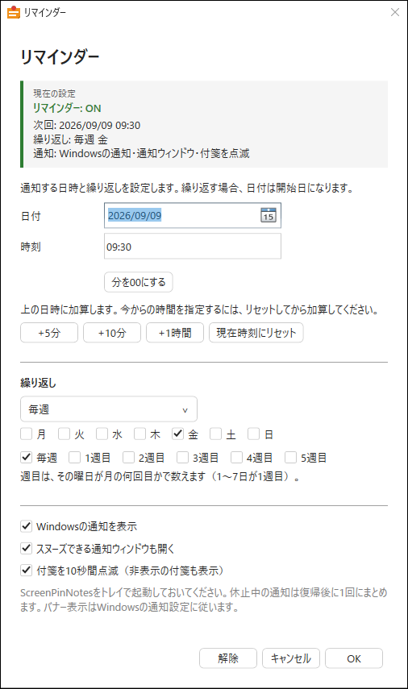
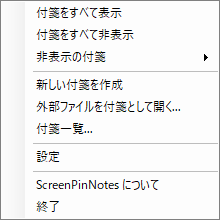
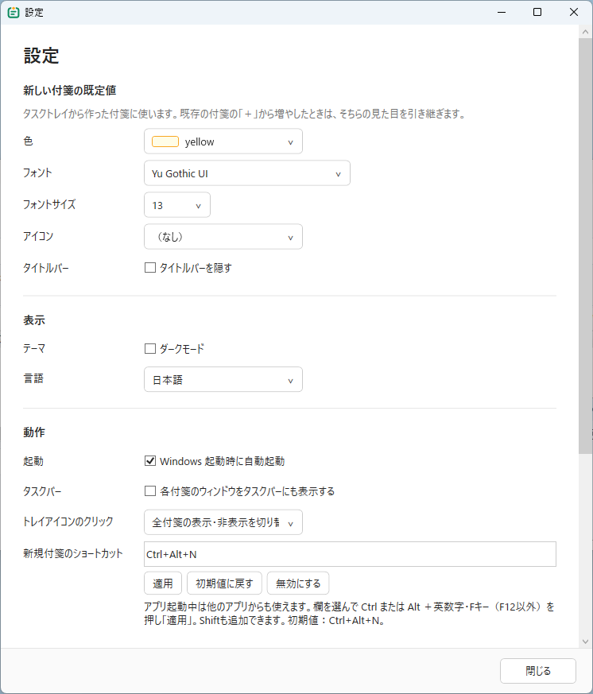

# 操作ガイド

[English](guide.md) | 日本語

[← README](../README.ja.md)

## 表示モード

タイトルバーの表示と、折りたたみ・展開は別々に切り替えます。

| タイトルバー | 展開表示 | 折りたたみ表示 |
| --- | --- | --- |
| あり | タイトル＋本文 | タイトルだけ |
| なし | 本文と右上の操作エリア | 本文の先頭行だけ。Markdown装飾は除去 |

- タイトルバーの表示は右クリックの **タイトルバーを隠す** で切り替えます。
- 本文が画像1枚だけの付箋は、本文の余白を詰めて画像を縁まで広げます。そのときの帯の扱いは設定の **画像だけの付箋** で選べます。「画像の横に並べる」は帯のぶんだけ場所を空け、「画像に重ねる」は画像を縁まで広げて帯をその上に描き、「帯を出さない」は帯ごと消します。
- タイトルバーを隠した付箋は左側に帯が付きます。折りたたむとタイトルバー表示の付箋と同じ1行になるため、その見分けを兼ねます。設定の **タイトルバー非表示の目印** で表示の有無と太さ（1〜12px）、置き方を変更できます。「端から離す」は端と本文のあいだに太さの変わらない線を引きます（上下も左と同じだけ空きます。端からの距離は0〜12px、既定は3px）。「端に付ける」は従来どおり端に貼り付き、角を丸めているとその分だけ端が細く見えます。本文は帯を避けて始まるので、帯と文字が詰まって見えることはありません。どちらの場合も帯は持ち手を兼ねていて、掴んで動かすとタイトルバーと同じように付箋を移動できます。
- 折りたたみ・展開は `⮝` / `⮟`、またはタイトルバーのダブルクリックで切り替えます。
- 画像だけの付箋の1行表示では画像パスを表示します。幅が足りない場合は `…/写真/image.png` のように末尾を優先します。
- タイトル未入力時は本文からタイトルを表示します。手入力したタイトルは優先されます。
- 編集中はMarkdownソースと「編集中」ラベルを表示。横スクロールバーが出ている間はラベルを上に寄せ、重ならないようにします。編集用の幅・高さは閲覧時と別に記憶します。
- 展開した付箋は操作中、一時的にピン止め付箋より手前に表示します。別のウィンドウへ移るか折りたたむと解除され、ピン止め設定は変わりません。

## マウス操作

| 場所・操作 | 動作 |
| --- | --- |
| 本文をダブルクリック | 編集を開始 |
| タイトルバーをドラッグ | 移動。画面端や他の付箋にスナップ |
| タイトルバーなしの右上の操作エリアをドラッグ | 付箋を移動 |
| タイトルバーをダブルクリック | 折りたたみ・展開。設定でシングルクリックに変更可能 |
| 枠をドラッグ | サイズ変更。折りたたみ中は幅のみ |
| 付箋をクリック | その付箋を前に出す（次に別の付箋を触るまで前のまま。重なり順の設定は書き換えません） |
| タイトル・本文を右クリック | 場所に応じたメニュー |
| リンクをクリック | リンクを開く |
| チェックリストのチェックをクリック | 完了・未完了を切り替え |
| スクロールできる本文を右ボタンドラッグ | 本文をスクロール |

## 修飾キー・ショートカット

アプリ起動中は **Ctrl+Alt+N** で、他のアプリからも新規付箋を作成できます。**Ctrl+Alt+Shift+N** では、クリップボードの文字・画像・コピーした画像ファイルから付箋を作成します（設定の「クリップボードから作成するショートカット」で変更）。設定の「新規付箋のショートカット」で欄を選択し、希望のキーを押して「適用」すると変更できます。「初期値に戻す」「無効にする」も選べます。他のアプリが使用中のキーは登録できず、元の設定を維持します。

| 操作 | 動作 |
| --- | --- |
| `Ctrl`＋ドラッグ | 現在の表示モードの位置だけ変更 |
| `Alt`＋ドラッグ | スナップせず移動 |
| `Ctrl+Alt`＋ドラッグ | 現在の表示モードだけ、スナップせず移動 |
| 本文上で `Ctrl`＋ホイール | 本文の文字サイズ変更 |
| タイトルバー上で `Ctrl`＋ホイール | タイトルの文字サイズ変更 |
| 画像上で `Ctrl`＋ホイール | 画像サイズ変更 |
| `Ctrl+Enter` / `Esc` / `✓` | 編集を終了。変更内容は保存されます |
| タイトル編集中に `Enter` | タイトル編集を確定 |
| `Ctrl+Z` | 編集を元に戻す |
| `Ctrl+Y` | 元に戻した編集をやり直す |
| `Enter`（編集中のリストの行） | 次の行に同じ印（次の番号・未完了のチェックボックス）を入れる。中身の無い項目では字下げを戻すか、リストを抜ける |
| `Tab` / `Shift+Tab`（編集中） | リストの行や選んだ複数行を字下げ / 字下げを戻す。それ以外の行では `Tab` でタブ文字を入力 |
| `Ctrl+C` / `Ctrl+X` / `Ctrl+V` | コピー・切り取り・貼り付け |
| `Alt+F4` / タスクバーの閉じる操作 | 付箋を非表示にする |

通常の移動では、展開・折りたたみの位置を連動させます。位置を分けた付箋は **折りたたみ時の位置にそろえる** で連動に戻せます。各表示の幅は別々に記憶します。隣接する付箋へのスナップでは、物理1ピクセルの隙間を残します。

## アイコンとツールバー



| 表示 | 意味・操作 |
| --- | --- |
| `＋` | 元の付箋の見た目を引き継いで新規作成 |
| `📌` | 常に最前面の切り替え |
| `⮝` / `⮟` | 折りたたむ / 展開する |
| `🦊` など | 付箋を識別するアイコン |
| `🔗` | 外部ファイルと連動中 |
| `🔒` | 編集ロック中 |
| `⛓️‍💥` | 展開・折りたたみの位置が分離中 |
| `⏰` | リマインダー設定中。ホバーで次回日時を確認 |
| `A−` / `A＋` | 本文の文字サイズ |
| `T−` / `T＋` | タイトル・1行表示の文字サイズ |
| `Aa` / `🦊` / `🎨`（ミニツールバー） | フォント / アイコン / 色を選択 |
| `↶` / `↷`（編集ツールバー） | 元に戻す / やり直す |
| 丸い `✓` | 編集を終了。ライトでは黒地、ダークでは白地 |

ミニツールバーは右クリックメニューの上と編集中の付箋の下に表示されます。タスクバー付近など下に空きがない場合、編集ツールバーは付箋の上に表示し、画面の作業領域内に収めます。`🔒`・`⛓️‍💥`・`⏰` は状態表示です。

編集ツールバーの `↶` / `↷` は、本文・タイトルのうち編集中の入力欄に作用します。自動保存後も取り消し・やり直しができ、操作できる履歴がないボタンは無効になります。

アイコン・カラーパレットは付箋より手前に表示します。編集ツールバーの同じボタンをもう一度押すと閉じます。パレット外をクリックするか、別のウィンドウに移ったときも閉じます。

## 右クリックメニュー



| 場所 | 主な操作 |
| --- | --- |
| タイトル | タイトル編集・コピー、重なり順、透明度、位置の連動を戻す |
| 本文（閲覧中） | コピー、リンクを開く、Excel表のコピー、画像に合わせたサイズ調整 |
| 本文（編集中） | 切り取り・貼り付け・すべて選択、Markdown書式、リンク編集、Excel表の貼り付け |
| 画像 | 本文のメニューの先頭に画像用の項目が加わります（画像のサイズ、この画像に合わせたサイズ調整、画像を外す・削除）。通常の項目もそのまま使えます |
| タイトル・本文共通 | タイトルバーを隠す、透明度、リマインダー、編集ロック、複製、非表示、削除 |

色・フォント・アイコンはメニュー上のミニツールバーから変更します。使えない操作は無効または非表示になります。

**付箋を複製**は、本文・見た目・貼り付けた画像を写した付箋を、元の付箋から少しずらして作ります。リマインダーは写しません。**非表示**は付箋を残し、**削除**は付箋を削除します。編集ロック中は本文・タイトルの編集と削除を制限しますが、表示サイズ・色・位置やチェックリストは操作できます。

## Markdown・画像・Excel

| 種類 | 記法・操作 |
| --- | --- |
| 見出し | `# 見出し` ～ `###### 見出し` |
| 文字装飾 | `**太字**`、`*斜体*`、`~~取り消し線~~`、`==ハイライト==` |
| コード | バッククォート1つでインライン、3つでブロックを囲む |
| リスト | `- 項目`、`1. 項目`（`1) 項目` も可。書いた番号から始まります）、`- [ ] タスク`。スペース2つ以上かタブで字下げすると入れ子になります |
| 引用・区切り | `> 引用`（続く行は1つの引用にまとまり、`>>` で入れ子。引用の中にもリストや見出しを書けます）、`---` |
| 字下げ | 行頭のスペース・タブ・全角スペースは字下げとして表示し、折り返した行も字下げの位置にそろえます |
| 改行と段落 | 既定では1行ずつ表示します。**設定 → 表示 → Markdown** で「続けて書いた行を1つの段落として折り返す」を有効にすると、空行までの行を1つの段落にまとめます（日本語はそのまま、英単語の間は半角スペースでつなぎます。行末にスペース2つか `\` で改行） |
| 表 | パイプで列を区切るMarkdown表。列揃えにも対応 |
| リンク | `[表示名](URL)`、`[表示名][1]` と別行の `[1]: URL`、通常のURL |
| 画像 | ``。`{width=240}` で幅指定 |

- 編集中の **Markdown書式** から記号を挿入できます（太字・取り消し線・ハイライト・コード・見出し・箇条書き・番号付きリスト・チェックリスト・引用）。**リンクを編集** で表示名とURLを変更できます。
- 貼り付けた画像は付箋の `assets` にPNG保存。ローカル画像を本文に表示します。Web画像URLはインライン表示しません。
- 画像ファイルを付箋にドロップするか、エクスプローラーでコピーして貼り付けると、元の形式のまま付箋の `assets` にコピーします。元のファイルはそのまま残ります。
- 画像は右クリックまたは `Ctrl`＋ホイールで20〜200%に調整できます。
- Excel表の貼り付け・コピーは右クリックメニューから行えます。画像の貼り付けにも対応します。
- 大きすぎる文書や深い入れ子は、内容を失わず原文表示に切り替えます。

## 付箋一覧



トレイの **付箋一覧** から開きます。重なり順・ピン止め・表示状態・ロック状態・タイトル・本文の抜粋・リマインダー・更新日時・外部パスを確認できます。

- **検索**：通常検索、ワイルドカード（`*` は任意の文字列、`?` は任意の1文字）、正規表現を切り替えます。大文字・小文字を区別せず検索し、不正な式や時間のかかりすぎる式はエラーを表示します。
- **検索履歴**：Enterまたは検索欄を離れたときに登録。最新30件を再起動後も保持し、入力欄のリストから再利用できます。**検索解除** は入力だけをクリアし、履歴を残します。
- **複数選択**：Ctrl／Shift＋クリックで選択し、**表示／非表示** を一括操作できます。削除・リマインダーなどは1件ずつ操作します。
- **重なり順**：一覧の上ほど手前です。**最前面・1つ上・1つ下・最背面** で移動し、順序は再起動後も保持します。非表示の付箋も順序を保持し、常に最前面の付箋は通常の付箋より上のグループになります。
- **ソート**：列見出しをクリックし、再クリックで昇順／降順を切り替えます（▲／▼）。一覧だけを並べ替え、実際の重なり順は変えません。**重なり順** の見出しでレイヤー順に戻ります。順序の編集はレイヤー順で検索解除後に行えます。

## リマインダー



付箋の右クリックまたは **付箋一覧** から設定します。日付はカレンダーから選択でき、設定画面はピン止め付箋より手前に表示されます。

**+5分・+10分・+1時間** は入力中の日時に加算します。連続クリックと日付またぎに対応します。**現在時刻にリセット** → **+10分** で今から10分後を指定できます。**分を00にする** は日付と時を保ち、分だけを00にします。保存時には未来の日時を指定してください。

| 繰り返し | 指定内容 |
| --- | --- |
| 1回のみ | 日付と時刻 |
| 毎日 | 開始日と毎日の時刻 |
| 毎週 | 開始日・時刻・曜日（複数選択可） |
| 毎月 | 開始日・時刻・日（1〜31日）。存在しない日は月末 |

Windows通知をクリックすると付箋一覧を開きます。同時刻の通知はまとめて表示します。通知ウィンドウも併用でき、5分・15分・1時間のスヌーズを選べます。スヌーズしても繰り返し時刻は維持します。

**付箋を10秒間点滅** は初期状態で有効です。非表示の付箋も表示し、付箋全体をオレンジ色でゆっくり点滅させます（本文は透けて読めます）。点滅する付箋は他のアプリの窓より前に出ます（**設定 → 動作 → リマインダー** でオフにできます。他の付箋は前に出ません）。クリック・キー入力・非表示で停止します。Windows通知、スヌーズ付き通知ウィンドウ、点滅は組み合わせて選択でき、点滅だけにもできます。

通知にはトレイ常駐が必要です。終了・休止中に過ぎた予定は再開後に1回通知します。バナーや音はWindowsの通知設定に従います。

## トレイ・設定・外部ファイル



| 機能 | 内容 |
| --- | --- |
| トレイを左クリック | 全付箋の表示切り替え、または新規作成（設定で選択） |
| トレイを右クリック | 新規作成・付箋一覧・非表示の付箋・設定・終了 |
| 付箋一覧 | タイトル・本文・外部パスなどを検索し、表示・リマインダー・削除を管理 |
| 非表示の付箋 | 個別に非表示にした付箋を戻す。「すべて表示」では戻りません |
| 設定 | 新規付箋の既定値、テーマ、言語、付箋の見た目、自動起動（起動時に付箋を表示せずトレイで待機する設定を含む）、タスクバー・トレイ動作、外部ファイルの更新間隔・tail 表示、保存先 |
| 外部ファイルを付箋として開く | `.md` / `.txt` / `.log` を読み取り専用で表示し、変更に追従（最短更新間隔は設定で変更可能） |
| クリップボードから付箋を作成 | クリップボードの文字・画像・コピーした画像ファイルから付箋を作成（画像は付箋側へコピー） |



付箋の見た目は **設定 → 表示** でまとめて変更できます。角の丸み（0〜16px。既定は「丸めない」）、枠の色（既定は「なし」。グレー／付箋の色も選べます）、アイコンの色（カラー／モノクロ）、タイトルバー非表示の目印。変更は開いている付箋にその場で反映されます。

既定の「なし」では、白い背景の上に淡い色の付箋を重ねると輪郭がほとんど見えません。輪郭を残したいときは枠の色を「グレー」か「付箋の色」にしてください。

0.2.0 以前から更新した場合、初回起動で見た目が変わります（丸い角とグレーの枠 → 角のまま・枠なし）。以前の見た目に戻すには、**設定 → 表示** で「角の丸み: 6」「枠の色: グレー」を選んでください。

設定は即時保存されます（ショートカットキーは「適用」で確定）。新規付箋の既定値はトレイ・ショートカットからの作成に適用され、既存付箋の `＋` は元の見た目を引き継ぎます。

外部ファイル付箋は `🔗` で識別でき、タイトルバーには最後に読み直した日時が表示されるので、内容が最新かどうか一目で分かります。アイコンやタイトルにマウスを乗せると、変更が自動で反映されること、ファイルのパス、最終更新の時刻を表示します。ファイルを開く・フォルダを開く・tail モードの切り替え・編集できる付箋に変換する操作があります。付箋の削除や画像表示サイズの変更で元ファイルは変更されません。

tail モード以外では、自動更新のたびにできるだけスクロール位置とキャレット位置を保ち、先頭に戻ってしまわないようにしています。

ログのように書き込み中のアプリがファイルを開いたままだと、Windows から変更の通知が届かないことがあります。そのためファイルのサイズと更新日時も1秒ごとに確認しています。1分間変化がなければ確認を止め、Windows から変更の通知が届いたときや、付箋にマウスを乗せた・クリックしたときに再開します。確認している間は、タイトル右端の小さな丸が確認のたびにゆっくり明滅します（ツールチップにも「変更を確認中」と表示します）。間隔と止めるまでの時間は `settings.json` の `ExternalFile.PollIntervalMs` と `ExternalFile.PollStopAfterMs` で変更できます。

tail モードでは、行の中のログレベルを色分けします（大文字小文字は問いません）。緑は `TRACE` `DEBUG` `INFO` `VERBOSE` `NOTICE`、橙は `WARN` `WARNING`、赤は `ERROR` `FATAL` `CRITICAL` `SEVERE` `PANIC` `ALERT` `EMERG` です。`TRC` `DBG` `INF` `WRN` `ERR` `FTL` といった3文字の略記や、`trce` `dbug` `fail` `crit` のような出力にも対応しています（1文字表記は本文と見分けが付かないため対象外です）。色を付けるのは各行で最初に見つかったレベル名だけです。数値は青で表示し、日時や件数を目で追いやすくしています。`2026-09-15` や `09:12:03.221`、`16/16` のように区切りで繋がった数値はひとまとまりとして扱います。

ファイルの中身が実際に変わったときは、付箋の枠が水色に1回光って知らせます。届いた行に `ERROR` `FATAL` が含まれていたときは、枠が赤く光り、付箋の背景色がその色から赤へ少し（4分の1）寄った色との間で2回点滅します（文字は覆いません）。その付箋を操作している最中は光りません（見ている本人には更新が届いているため）。中身が変わらない保存（更新日時だけ触るような書き込み）では読み直しも点滅もしません。

tail モードにすると、ファイルの末尾数行（行数は設定で変更可能）だけをプレーンテキストで表示し、追記されるたびに常に最新行へ自動スクロールします。ログの監視に向いた表示です。`.log` ファイルは既定で tail モードになります。他の外部ファイル付箋でも、右クリックメニューから切り替えられます。tail モード中はタイトルバーの右側に `⏬` が出るので、ホバーすると表示中の行数も確認できます。

## 保存・バックアップ

本文・タイトルは編集中も自動保存します。既定では入力を止めて約0.8秒後、連続入力中も約5秒ごとに保存します。編集終了時にも保留中の変更を保存するため、`Esc` は変更の取り消しにはなりません。

既定の保存場所は `%AppData%\ScreenPinNotes` です。

```text
ScreenPinNotes/
├─ settings.json
├─ logs/app.log
└─ notes/<付箋ID>/
   ├─ meta.json     # 位置・色・リマインダーなど
   ├─ content.md    # 本文
   └─ assets/       # 画像
```

保存先の変更とzipのエクスポート・インポートは **設定** から行います。インポートは既存付箋を上書きせず追加します。本文の上限は既定で1MBです。

別のデータ環境で起動する場合は `SCREENPINNOTES_DATA` を指定できます。`settings.json` を直接編集するときはアプリを終了してください。

特定の PC でだけ起きる不具合を調べるときは、`settings.json` の `"EnableDiagnosticTrace"` を `true` にして（または環境変数 `SCREENPINNOTES_TRACE=1` を指定して）アプリを起動し直してください。サイズ変更・折りたたみと、それに関わる Windows のメッセージが、画面やマウスの設定と一緒にデータフォルダの `logs\trace.log` に記録されます。付箋のタイトルや本文は記録しません。調べ終わったら元に戻してください。

## 開発・ライセンス

Windowsと.NET 8 SDKを使用します。

```powershell
git clone https://github.com/umineko73/ScreenPinNotes.git
cd ScreenPinNotes
dotnet build
dotnet run --project src
dotnet test
```

配布zipの作成：`powershell -ExecutionPolicy Bypass -File scripts/publish.ps1`（出力先：`artifacts/`）。翻訳の追加は [ローカライズ手順](localization.md) を参照してください。

[GNU General Public License v3.0 or later](../LICENSE) · Copyright (C) 2026 umineko73
