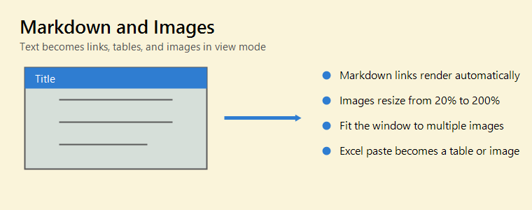

# Markdown and Image Manual



The body supports Markdown. This is **bold**, *italic*, and `inline code`.

## Links

- Auto URL link: https://www.google.com
- Auto Windows path link: C:\Users
- Markdown link: [OpenAI](https://openai.com/)
- URLs and paths that contain `(` can be recognized
- URL encoding such as `%28` and `%29` also works when needed

## Lists and Checklists

- Bullet item
- Numbered lists are supported

1. First
2. Second

- [x] Completed item
- [ ] Click in view mode to toggle

## Images

- Images render with ``
- Resize images from the right-click menu or with the mouse wheel
- The minimum size is 20%, and the maximum size is 200%
- Images without an explicit width fit inside the note when they would overflow
- When a zoomed image has scrollbars, drag with the left mouse button to scroll it
- Use "Fit window to image" from an image context menu to resize the note for that image
- Use "Fit window to images" from the body context menu to include multiple images

## Paste

- Excel cell ranges can be pasted as Markdown tables
- Normal paste from Excel can paste an image when the clipboard contains one
- Transparent images are handled so visible content remains visible

> Quotes are supported too.

---

| Format | Syntax | Rendered |
| --- | --- | --- |
| Bold | `**text**` | **text** |
| Link | `[Amazon](https://www.amazon.com/)` | [Amazon](https://www.amazon.com/) |

```csharp
var note = "Markdown ready";
Console.WriteLine(note);
```
