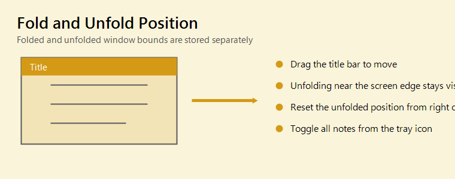

# Usage Help

This note has editing locked. The body text and title text are protected, but checkboxes, display sizes, position, color, and similar view settings can still be adjusted.

## Basics

- Double-click the body: switch to edit mode
- `Esc`: return to view mode
- Double-click the title bar: collapsed view / expanded view
- Drag the title bar: move the note
- Click a link: open it
- In edit mode, use `Ctrl + click` to open a link
- Right-drag in a body pane with scrollbars: scroll the pane

## Mouse Wheel

| Area | Action |
| --- | --- |
| Body | `Ctrl + wheel` changes the body font size |
| Title bar | `Ctrl + wheel` changes the title font size |
| Image | `Ctrl + wheel` changes the image display size |

## Moving and Snapping

Left: expanded view (body text visible). Right: collapsed view (only the title bar remains). Each view's position can be adjusted independently with the actions below.

- Normal drag: keep collapsed view and expanded view positions synchronized
- `Ctrl + drag`: adjust only the current view
- `Alt + drag`: disable snapping
- `Ctrl + Alt + drag`: adjust only the current view without snapping
- Notes with separated collapsed view and expanded view positions show `⛓️‍💥` in the title bar
- A setting can restore single-click switching

## Title Context Menu

- Edit title
- Change stacking order
- Change opacity
- Align to collapsed position
- Set / clear a reminder
- For external-file notes, open the file / open its folder / convert to an editable note
- Lock editing
- Hide
- Delete note (keep original file for external-file notes)

While editing is locked, the title text cannot be edited and the note cannot be deleted.

## Body Context Menu

- Cut / copy / paste
- Paste as Markdown link
- Paste / copy Excel tables
- Open link
- Convert to Markdown link
- Resize note to fit images
- Set / clear a reminder
- External-file actions for external-file notes
- Lock editing
- Hide
- Delete note (keep original file for external-file notes)

While editing is locked, text input, paste, link conversion, image insertion, and image removal are disabled.

## External-File Notes

- Use "Open external file as note..." from the tray menu to show a `.md` / `.txt` file as a read-only note
- Use "Note list..." from the tray menu to search titles, body text, and external file paths
- External-file notes show `🔗` at the left of the title bar; hover the title or `🔗` to see the file path
- Notes reload when the external file changes
- Image size changes in external-file notes are saved as note-local display settings; the original file is not modified
- "Convert to editable note" keeps the content in the note and stops following the external file. The original file is kept
- "Delete note (keep original file)" deletes only the note, leaving the original file intact

## Reminders

- Set a one-time reminder from a note context menu or from "Note list..."
- Notes with reminders show `⏰` in the title bar
- Hover `⏰` to see the scheduled time
- When due, the note is shown and you can choose Done, 5 minutes, 15 minutes, or 1 hour snooze

## Title Bar Buttons

| Button | Action |
| --- | --- |
| + | Add a note using this note's color, icon, and font |
| 📌 | Always on top |
| Up / Down | Collapsed view / Expanded view |
| 🔒 | Shows that editing is locked |
| ⛓️‍💥 | Shows that collapsed view and expanded view positions are separated |
| 🔗 | Shows an external-file note |
| ⏰ | Shows that a reminder is set |

The lock is only a status indicator. It is not clickable, so it does not interfere with dragging or switching collapsed/expanded view.

## Tray Icon

- Left-click: show / hide all notes
- Right-click: show hidden notes, create a note, open an external-file note, open the note list, open settings, exit
- Settings: storage folder, export, import, language, dark mode, and more

## Storage and Backup

- Data folder: `%APPDATA%\ScreenPinNotes`
- Each note is stored under `notes` with `meta.json`, `content.md`, and `assets`
- "Export notes..." creates a zip backup
- "Import notes..." adds notes without overwriting existing notes
