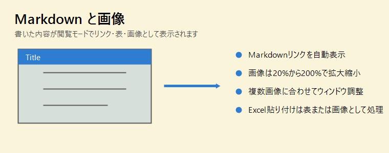

# Markdown・画像マニュアル



本文は Markdown で書けます。これは **太字**、*斜体*、`インラインコード` の例です。

## リンク

- URL自動リンク: https://www.google.com
- Windowsパス自動リンク: C:\Users
- Markdownリンク: [OpenAI](https://openai.com/)
- URLやパスに `(` が含まれる場合も認識できます
- 必要な場合は `%28` と `%29` のようなURLエンコードも使えます

## リストとチェックリスト

- 箇条書き
- 番号付きリストも使えます

1. 1つ目
2. 2つ目

- [x] 完了した項目
- [ ] 閲覧モードのままクリックして切り替え

## 画像

- 画像は `` の形式で表示されます
- 画像サイズは右クリックまたはマウスホイールで変更できます
- 最小サイズは20%、最大サイズは200%です
- サイズ指定がない画像が付箋からはみ出る場合は、付箋の幅に合わせて表示されます
- 拡大してスクロールバーが出た画像は、左ボタンドラッグでスクロールできます
- 右クリックの「画像にウィンドウをフィット」で、その画像に合わせて付箋を調整できます
- 本文の右クリックメニュー「ウィンドウを画像にフィット」は、複数画像を含めて全体に合わせます

## 貼り付け

- Excelのセル範囲は表として貼り付けできます
- Excelから通常ペーストしたとき、クリップボードに画像があれば画像として貼り付けできます
- 透明な画像も、見える内容が残るように処理されます

> 引用も表示できます。

---

| 書式 | 記法 | 表示 |
| --- | --- | --- |
| 太字 | `**text**` | **text** |
| リンク | `[Amazon](https://www.amazon.com/)` | [Amazon](https://www.amazon.com/) |

```csharp
var note = "Markdown対応";
Console.WriteLine(note);
```
