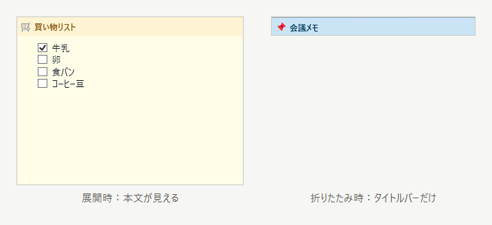

# 操作ヘルプ

この付箋は編集ロック中です。本文やタイトル文字列は保護されますが、チェックボックス、表示サイズ、位置、色などは調整できます。

## 基本操作

- 本文をダブルクリック: 編集モードに切り替え
- `Esc`: 閲覧モードに戻る
- タイトルバーをダブルクリック: 折りたたみ表示 / 展開表示
- タイトルバーをドラッグ: 付箋を移動
- リンクをクリック: リンクを開く
- 編集モード中のリンクは `Ctrl + クリック` で開く
- スクロールバーが出ている本文ペインで右ボタンドラッグ: ペインをスクロール

## ツールバー

右クリックメニューの上にはミニツールバーを表示します。`A-` / `A+` は本文サイズ、`T-` / `T+` はタイトルサイズ、`Aa` はフォント、🦊 はアイコン、🎨 は色の変更です。色・アイコン変更の独立したメニュー項目はありません。

編集時は付箋の下に同じツールバーと緑色の `✓`（編集完了）を表示します。`Ctrl+Enter` または `Esc` でも編集を終了できます（変更を取り消す操作ではありません）。ツールバーは移動・リサイズに追従し、リンク編集ダイアログの表示中は隠れます。

## 編集用サイズ

初回の編集は通常表示と同じサイズです。編集中にリサイズすると、その幅・高さを付箋ごとに記憶します。編集終了時は通常サイズに戻り、次回編集時に編集用サイズを再適用します。位置は通常表示と共通で、画面外にはみ出す場合は補正します。折りたたみ時の幅は別に保存します。

## 色・アイコン・フォント

- ダーク系6色を含む配色を選べます。ダーク系はライトモードでも暗い背景を保ちます。アプリのダークモードでは既存の淡色も暗色化し、文字・リンク・色見本を配色に合わせます。
- アイコンは色・記号、緊急・優先度、状態・進捗、メモ・資料、発想・調査、予定・連絡、仕事・開発、日常、動物の分類から選べます。🔥、色付きの丸・四角、動物15種類も利用できます。🔗は外部ファイル状態専用、Webの目印には🌐を使います。
- インストール済みフォントを日本語名優先で表示します。記号専用と判定できたフォントを除外し、判定できないものは残します。一覧は初回に読み込み、失敗時は再試行できます。
- よく使うフォントは最大5件を `★` 付きで上部に表示します。選択回数は全付箋で共有し、再起動後も保持します。

## Markdown入力補助

編集中に文字列を選択して右クリックし、**Markdown書式** から太字、取り消し線、インラインコード、見出し1〜3、箇条書き、チェックリスト、リンクを選べます。行の書式は選択がかかる行全体に適用します。太字などは選択がないと記号の間にカーソルを置き、対応する同じ書式の再選択で解除できます。`Ctrl+Z` で元に戻せます。

既存リンク内にカーソルを置いて **リンクを編集...** を選ぶと、表示テキストとURLを別々に編集できます。URLは折り返し表示され、ダイアログは拡大できます。**Markdown書式 > リンクを挿入・編集...** から新規リンクも作成できます。

任意の書式の組み合わせを検証・修正する機能ではありません。描画失敗時は原文表示へ切り替えます。深い入れ子（16段）、長いインライン文字列（8,192文字超）、大きい文書（131,072文字超または改行2,000個超）は解析を制限して原文を表示します。本文自体は削除しません。

## マウスホイール

| 場所 | 操作 |
| --- | --- |
| 本文 | `Ctrl + ホイール` で本文フォントサイズ変更 |
| タイトルバー | `Ctrl + ホイール` でタイトルフォントサイズ変更 |
| 画像 | `Ctrl + ホイール` で画像表示サイズ変更 |

## 移動とスナップ

左：展開表示（本文が見える）。右：折りたたみ表示（タイトルバーだけになる）。それぞれの表示位置は下記の操作で個別に調整できます。

- 通常ドラッグ: 折りたたみ表示と展開表示の位置を同期
- `Ctrl + ドラッグ`: 現在の表示だけ位置調整
- `Alt + ドラッグ`: スナップを無効化
- `Ctrl + Alt + ドラッグ`: スナップなしで、現在の表示だけ位置調整
- 折りたたみ表示と展開表示の位置が分離中の付箋は、タイトルバーに `⛓️‍💥` を表示
- 設定でシングルクリック切り替えに戻せます

## タイトル右クリックメニュー

- タイトルを編集
- 重なり順を変更
- 不透明度を変更
- 折りたたみ時の位置にそろえる
- リマインダーを設定 / 解除
- 外部ファイル付箋では外部ファイルを開く / フォルダを開く / 編集できる付箋に変換
- 編集をロック
- 非表示
- 削除（外部ファイル付箋では元のファイルを残す）

編集ロック中は、タイトル文字列の編集と削除はできません。

## 本文右クリックメニュー

- 切り取り / コピー / 貼り付け
- Markdownリンクとして貼り付け
- Excel表の貼り付け / コピー
- リンクを開く
- Markdownリンクに変換
- 画像に合わせて付箋のサイズを調整
- リマインダーを設定 / 解除
- 外部ファイル付箋では外部ファイル操作
- 編集をロック
- 非表示
- 削除（外部ファイル付箋では元のファイルを残す）

編集ロック中は、本文の入力、貼り付け、リンク変換、画像の追加や削除はできません。

## 外部ファイル付箋

- タスクトレイの「外部ファイルを付箋として開く...」から `.md` / `.txt` を読み取り専用付箋として表示
- タスクトレイの「付箋一覧...」でタイトル、本文、外部ファイルパスを検索
- 外部ファイル付箋の左上には `🔗` が表示され、タイトルや `🔗` にマウスを乗せるとファイルパスを確認できます
- 外部ファイルが更新されると付箋も再読み込みします
- 外部ファイル付箋の画像サイズ変更は付箋側の表示設定として保存し、元ファイルは変更しません
- 「編集できる付箋に変換」は、内容を付箋に取り込み、外部ファイルとの連動を解除します。元のファイルは残ります
- 「付箋を削除（元のファイルは残す）」は、付箋だけを削除します

## リマインダー

- 付箋の右クリックメニュー、またはタスクトレイの「付箋一覧...」から単発リマインダーを設定
- リマインダー付きの付箋はタイトルバーに `⏰` を表示
- `⏰` にマウスを乗せると予定時刻を確認できます
- 時刻になると付箋を表示し、完了 / 5分 / 15分 / 1時間のスヌーズを選べます

## タイトルバーのボタン

| ボタン | 動作 |
| --- | --- |
| + | この付箋の色・アイコン・フォントを引き継いで新規作成 |
| 📌 | 常に最前面 |
| ▲ / ▼ | 折りたたみ表示 / 展開表示 |
| 🔒 | 編集ロック中の表示 |
| ⛓️‍💥 | 折りたたみ表示と展開表示の位置が分離中の表示 |
| 🔗 | 外部ファイル付箋の表示 |
| ⏰ | リマインダー設定中の表示 |

鍵は状態表示だけです。クリック対象ではないので、ドラッグや折りたたみ表示/展開表示の切り替え操作の邪魔になりません。

## タスクトレイ

- 左クリック: 全付箋の表示 / 非表示
- 右クリック: 非表示の付箋を再表示、新規作成、外部ファイル付箋、付箋一覧、設定、終了
- 設定: 保存フォルダ、エクスポート、インポート、言語、ダークモードなど

## 保存とバックアップ

- 保存場所: `%APPDATA%\ScreenPinNotes`
- 付箋は `notes` フォルダ内に、1枚ずつ `meta.json`、`content.md`、`assets` として保存されます
- 「付箋をエクスポート...」で zip バックアップを作成できます
- 「付箋をインポート...」は既存付箋を上書きせず、追加として取り込みます
